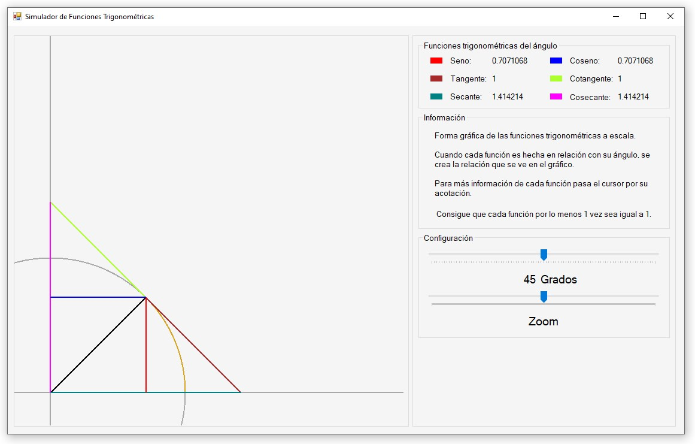

# Funciones-Trigonometricas
Proyecto de primer cuatrimestre con el uso de Windows Forms y C#.

La idea de este proyecto surgió de [Tattoos on Math](https://www.youtube.com/watch?v=IxNb1WG_Ido) un vídeo en donde se muestra la relación geométrica que tienen las funciones trigonométricas.

